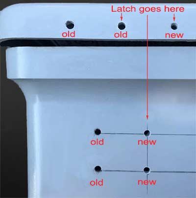
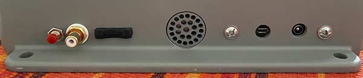
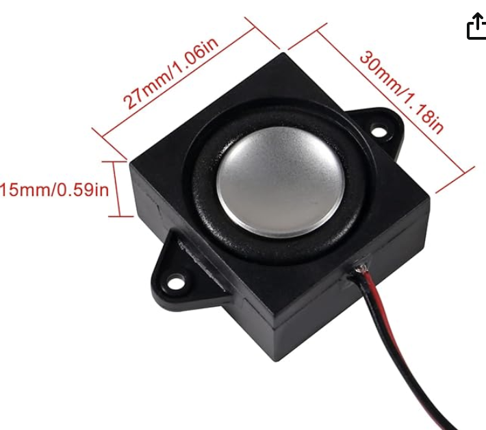
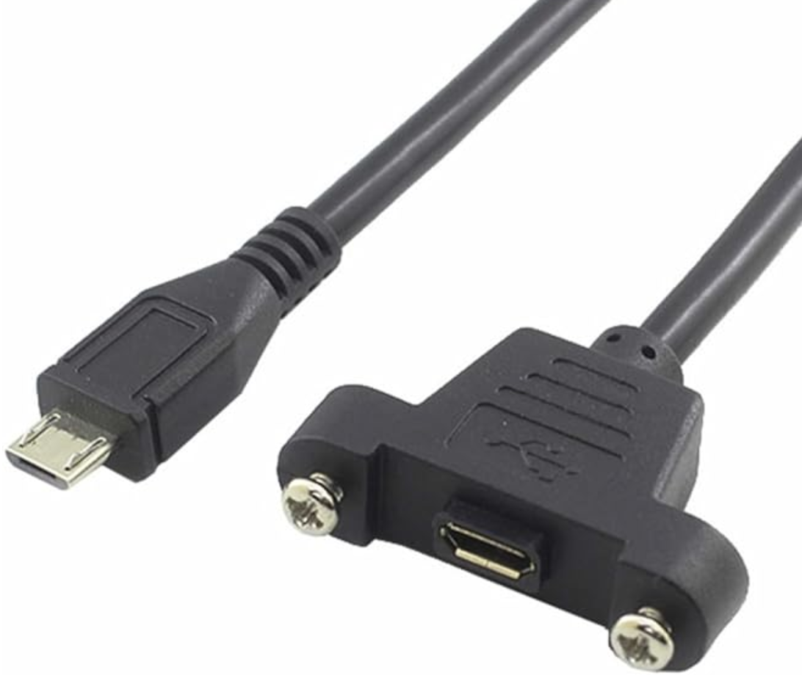
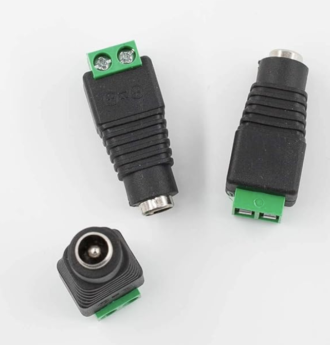

# Flux Capacitor Hardware & Build Information

CircuitSetup provides the [electronics](https://circuitsetup.us/product/flux-capacitor-light-sound-pcb), a [window kit](https://circuitsetup.us/product/flux-capacitor-window-kit) and the [back board](https://circuitsetup.us/product/flux-capacitor-backing-board). Here is some information on the other parts you'll need.

## Box

The box is a [Stahlin J1210HPL](https://stahlin.com/product/j-series-12-x-10-x-5-inches-j1210hpl-enclosure/), still available. The color does not match the movies, but it can be spray-painted; a suitable color would be Pantone 423C.

CircuitSetup's kits come with templates for holes and the door window.

For replicating exactly what is seen in the movies, the door latches need to be moved inward by one inch:

**&#9888; Warning: This box is made from molded fiberglass reinforced polyester. This is a highly dangerous material, so wear a proper mask when drilling, sawing or sanding.**

The Original FC's box, as used in the movies, has six large holes at the bottom. I didn't drill those holes because a) they aren't visible anyway, and b) those holes allow light from the inside to flood out and cause unwanted effects.

Instead, I used the buttom for the controls and connectors.

Since the SD card on the control board is inaccessible after assembling the FC (but required to install the audio files, and possibly used for music files), I used a microSD extension (like [this one](https://www.amazon.com/Memory-Micro-SD-Female-Extension-Extender/dp/B09MS85FQ3/)), and mounted the slot through a hole in the bottom of my FC so that the SD card can be accessed at any time.

From left to right:
- Time Travel button (connects "TT_IN" and "3V3" on the FC control board)
- Time Travel input for connecting TCD by wire (outer: GND, inner "TT_IN" from the FC control board)
- microSD extension
- Speaker (using Radbench's speaker grill "Speaker_Grill_RBv1")
- USB and power (using Radbench's bracket "PowerUsbMount")

As a speaker, I used [this](https://www.amazon.com/ACEIRMC-Loundspeaker-JST-PH2-0-Interface-Electronic/dp/B0BTM1VCBM/ref=sr_1_8) one; I cut off the latches and glued it onto the back side of the [back board](https://circuitsetup.us/product/flux-capacitor-backing-board).

The USB connector is the end of an USB extension cable like this one; I simply trimmed it to fit into the bracket.

The power connector is an adapter like this, which fits nicely into the bracket:

Since the bright LEDs draw considerable power, it is recommended to drive the FC at 12V-20V (as opposed to 5V).

## Torr relays & co

The CircuitSetup back board is made to fit the Torr relay replicas and accessories from [Radbench](https://www.thingiverse.com/thing:5164173)'s collection, such as cable boots, L-brackets and acrylic "light-bars".

Since I try to avoid 3D-printed parts as much as possible, I went for replicas made from brass by user [stuff565](https://www.ebay.co.uk/usr/stuff565) on ebay (he is a well known member of the Delorean Time Machine Builders scene). Suitable boots for the ignition cables are available [here](https://movieprops.blog/shop/) or (sometimes) from [maxthemad](https://www.ebay.co.uk/usr/maxthemad).

If you go this route, you need to enlarge the holes in CircuitSetup's back board to fit the tubes, and due to their weight, the "relays" need to be screwed onto the back board. The resin inside the relay replicas is fine for screws, a bit of pre-drilling is recommended. I used three screws per "relay".

Also, for the brass relay replicas, 
- the L-bracket and the cable boots needs to be larger, and
- the light bars need to be a bit taller.

Suitable STL-files matching the brass-replicas for brackets ("Relay_L_Bracket_v1"), boots ("Spark_Boot") and light bars ("Light bar - 81x29") are in this repository. (The boots are an alternative to maxthemad's, and need some trimming to fit; I preferred this way because my boots better resemble the ones shown in the movies.)

The yellow cables are simply yellow 7mm ignition cables, easy to find. The boots are painted in RAL2008, although I don't know if this is authentic. I used the O-rings ("Spark_O-Ring_RBv1", same color as boots) designed by Radbench.

## Light bars

The light bars are 10mm acrylic glass. I am sure you'll find someone to cut them for you, an STL file and a pic showing the dimensions are here in this repo ("Light bar - 81x29" and "lightBar_Dims").

Radbench and others usually spray paint the light bars with "mirror silver" before coating them in black. I had no luck with this since it caused cracks in the acrylic. So I skipped this step and only painted the outsides black (using a _water-based_ color). IMHO the mirror paint is pointless, since the light is reflected by the surface of the acrylic glass anyway. 

As a final step I slightly sanded the unpainted top surfaces so that the individual LEDs aren't clearly visible in the end.

## External stuff

Elbows: These are aviation plugs going by MS3108B, dimensions 20-29 and 32. On the original, these were made by Cannon (ITT), but those are no longer available. JAE is a suitable replacement, and those offered by Chinese vendors on ebay also match closely. I removed the electrical components inside the plug and used screws to attach it to the box. (Good replicas are available [here](https://movieprops.blog/shop/).)

Big pipe on top: On the Original, allegedly Lasco 2"; I used a Genova 30720 (2"). Beware, many ebay sellers quietely ship other brands/models despite explicitly advertising this type. In order to attach it to the box, I glued a disc of wood into the bottom end, and screwed it onto the top part of the box. (A good replica is now available [here](https://movieprops.blog/shop/).)

The black pipe on the left and the hose on the right are fully custom made; the hose is enclosed in parts used in compressed air equipment. Both are attached using screws.

If you avoid 3D-printed parts in general (or use a UV- and heat-resistant resin) and attach parts properly, the FC is perfectly fine to be mounted in an actual Delorean.

_Text & images: (C) Thomas Winischhofer ("A10001986"). See LICENSE._ Source: https://fc.out-a-ti.me

