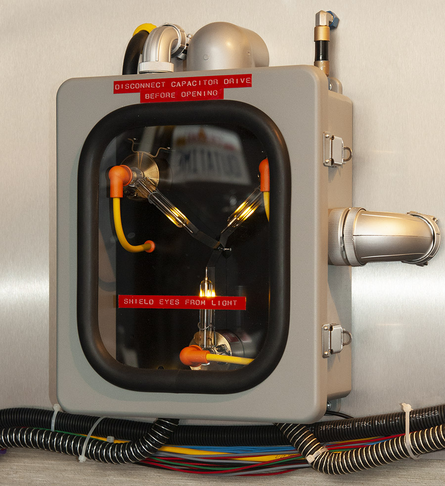
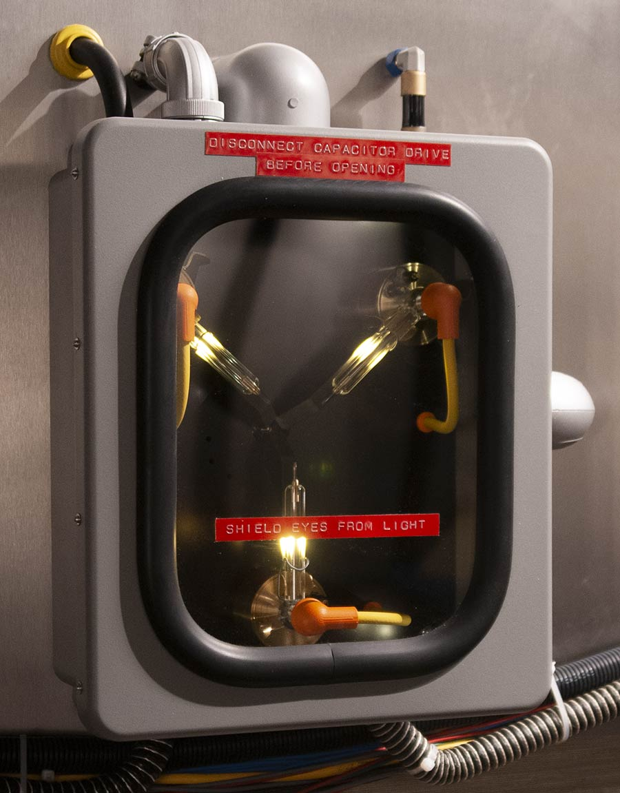
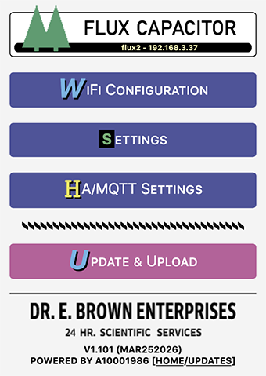
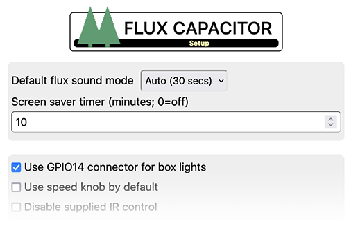

# Flux Capacitor

This [repository](https://fc.out-a-ti.me) holds the most current firmware for CircuitSetup's excellent [Flux Capacitor Light & Sound Control Board](https://circuitsetup.us/product/flux-capacitor-light-sound-pcb/). The "Flux Capacitor" is a key component of the Delorean Time Machine.

The kit parts are available [here](https://circuitsetup.us/product-category/movie-props/).

Here is my FC, built around this Control Board and the other parts of the kit ([backing board](https://circuitsetup.us/product/flux-capacitor-backing-board/), [window kit](https://circuitsetup.us/product/flux-capacitor-window-kit/); see [here](Hardware.md) for more information on the other parts used):




| [](https://youtu.be/BG8tXd8mnxQ?si=j7_hBTBNLE-TKOMw) |
|:--:|
| Click to watch the video |

The Flux Capacitor can be used stand-alone, or in connection with CircuitSetup's [Time Circuits Display](https://tcd.out-a-ti.me). If [built properly](Hardware.md), the Flux Capacitor is perfectly fit for mounting in your Delorean.

Features include
- movie-accurate default flux sequence, plus 9 alternative flux sequences
- optional [flux](#the-flux-sound) sound (4 modes)
- [Time Travel](#time-travel) function, triggered by button, [Time Circuits Display](https://tcd.out-a-ti.me) (TCD) or via [MQTT](#home-assistant--mqtt)
- [IR remote controlled](#ir-remote-control); can learn keys from third-party remote
- [music player](#the-music-player): Play mp3 files located on an SD card
- [SD card](#sd-card) support for custom audio files for effects, and music for the Music Player
- advanced network-accessible [Config Portal](#the-config-portal) for setup (http://flux.local, hostname configurable)
- [wireless communication](#bttf-network-bttfn) with [Time Circuits Display](https://tcd.out-a-ti.me); used for synchronized time travels, alarm, chase speed, night mode, fake power, remote control through TCD keypad, or [remote controlling](#remote-controlling-the-tcds-keypad) the TCD keypad.
- [Home Assistant](#home-assistant--mqtt) (MQTT 3.1.1) support
- built-in OTA installer for firmware updates and audio files
  
## Power supply

Since the bright LEDs draw considerable power, it is recommended to use a short cable with large wire diameters (min AWG16) between the power supply and the FC, and to drive the FC at 12V-20V (as opposed to 5V). A long/thin cable, due to its resistance, might cause under-voltage and therefore problems like LEDs behaving erratically or even crashes of the FC's CPU.

## Installation

If a previous version of the Flux Capacitor firmware is installed on your device, you can update easily using the pre-compiled binary. Enter the [Config Portal](#the-config-portal), click on "Update" and select the pre-compiled binary file provided in this repository ([install/fluxcapacitor-A10001986.ino.nodemcu-32s.bin](https://github.com/realA10001986/Flux-Capacitor/blob/main/install/fluxcapacitor-A10001986.ino.nodemcu-32s.bin)).

If you are using a fresh ESP32 board, please see [fluxcapacitor-A10001986.ino](https://github.com/realA10001986/Flux-Capacitor/blob/main/fluxcapacitor-A10001986/fluxcapacitor-A10001986.ino) for detailed build and upload information, or, if you don't want to deal with source code, compilers and all that nerd stuff, go [here](https://install.out-a-ti.me) and follow the instructions.

 *Important: After a firmware update, the inner and outer LEDs might blink alternately for short while after reboot. Do NOT unplug the device during this time.*

### Sound-pack installation

The firmware comes with a sound-pack which needs to be installed separately. The sound-pack is not updated as often as the firmware itself. If you have previously installed the latest version of the sound-pack, you normally don't have to re-install it when you update the firmware. Only if either a the FC puts up a respective [signal](#appendix-b-led-signals) at startup, or your device is quiet after a firmware update, a re-installation/update is needed.

The first step is to download "install/sound-pack-xxxxxxxx.zip" and extract it. It contains one file named "FCA.bin".

Then there are two alternative ways to proceed. Note that both methods *require an SD card*.

1) Through the [Config Portal](#the-config-portal). Click on *Update*, select this file in the bottom file selector and click on *Upload*.

2) Via SD card:
- Copy "FCA.bin" to the root directory of of a FAT32 formatted SD card;
- power down the Flux Capacitor,
- insert this SD card into the slot and 
- power up the Flux Capacitor; the sound-pack will be installed automatically.

After installation, the SD card can be re-used for [other purposes](#sd-card).

## Initial Configuration

>The following instructions only need to be followed once, on fresh FCs. They do not need to be repeated after a firmware update.

The first step is to establish access to the FC's configuration web site ("Config Portal") in order to configure your FC:

- Power up your FC and wait until the startup sequence has completed.
- Connect your computer or handheld device to the WiFi network "FC-AP".
- Navigate your browser to http://flux.local or http://192.168.4.1 to enter the Config Portal.

#### Connecting to a WiFi network

Your FC knows two ways of WiFi operation: Either it creates its own WiFi network, or it connects to a pre-existing WiFi network.

As long as your FC is unconfigured, it creates its own WiFi network named "FC-AP". This mode of operation is called **"Access point mode"**, or "AP-mode". 

It is ok to leave it in AP-mode, predominantly if used stand-alone. (To keep operating your FC in AP-mode, do not configure a WiFi network as described below, or check "Forget saved WiFi network" and click "Save" on the Config Portal's "WiFi Configuration" page.)

>Please do not leave computers/hand helds permanently connected to the FC's AP. These devices might think they are connected to the internet and therefore hammer the FC with DNS and HTTP requests which might lead to packet loss and disruptions.

>If you want your device to remain in AP-mode, please choose a suitable WiFi channel on the Config Portal's "WiFi Configuration" page. See [here](#-wifi-channel).

>For experts: In the following, the term "WiFi network" is used for both "WiFi network" and "ip network" for simplicity reasons. However, for BTTFN/MQTT communication, the devices must (only) be on the same ip network, regardless of how they take part in it: They can be can be connected to different WiFi networks, if those WiFi networks are part of the same ip network, or, in case of the MQTT broker, by wire. If the TCD operates as access point for other props, connecting a prop to the TCD's WiFi network also takes care of suitable ip network configuration through DHCP.

##### &#9654; Home setup with a pre-existing local WiFi network

In this case, you can connect your FC to your home WiFi network: Click on "WiFi Configuration" and either select a network from the top of the page or enter a WiFi network name (SSID), and enter your WiFi password. After saving the WiFi network settings, your FC reboots and tries to connect to your selected WiFi network. If that fails, it will again start in access point mode.

>If you have a [Time Circuits Display](https://tcd.out-a-ti.me) note that in order to have both FC and TCD communicate with each other, your FC must be connected to the same network your TCD is connected to. In order to use MQTT, your FC must be connected to the same network your broker is connected to.

>Your FC requests an IP address via DHCP, unless you entered valid data in the fields for static IP addresses (IP, gateway, netmask, DNS). If the device is inaccessible as a result of incorrect static IPs, wait until it has completed its startup sequence, then type \*123456OK on the IR remote; static IP data will be deleted and the device will return to DHCP after a reboot.

##### &#9654; Places without a WiFi network

In this case and with no [Time Circuits Display](https://tcd.out-a-ti.me) at hand, keep your FC operating in AP-mode.

If you have a TCD, you can connect your FC to the TCD's own WiFi network: Run the TCD in AP-Mode, and on your FC's Config Portal, click on "WiFi Configuration" and either select "TCD-AP" from the top of the page or enter "TCD-AP" under *Network name (SSID)*. If you password-proteced your TCD-AP, enter this password below. See [here](#car-setup) for more details.

After completing WiFi setup, your FC is ready for use; you can also continue configuring it to your personal preferences through the Config Portal.

## The Config Portal

The "Config Portal" is the FC's configuration web site. 

|  |
|:--:| 
| *The Config Portal's main page* |

It can be accessed as follows:

#### If FC is in AP mode

- Connect your computer or handheld device to the WiFi network "FC-AP".
- Navigate your browser to http://flux.local or http://192.168.4.1 to enter the Config Portal.
- (For proper operation, please disconnect your computer or handheld from FC-AP when you are done with configuring your FC. These devices can cause high network traffic, resulting in severe performance penalties.)

#### If FC is connected to a WiFi network

- Connect your hand-held/computer to the same (WiFi) network to which the FC is connected, and
- navigate your browser to http://flux.local

  >Accessing the Config Portal through this address requires the operating system of your hand-held/computer to support Bonjour/mDNS: Windows 10 version TH2     (1511) [other sources say 1703] and later, Android 13 and later; MacOS and iOS since the dawn of time.

  >If connecting to http://flux.local fails due to a name resolution error, you need to find out the FC's IP address: Type *90 followed by OK on the supplied remote control and listen, the IP address will be spoken out loud. Then, on your handheld or computer, navigate to http://a.b.c.d (a.b.c.d being the IP address as read out loud by the FC) in order to enter the Config Portal.

In the main menu, click on "Settings" to configure your Flux Capacitor. 

| [](img/cp_setup.png) |
|:--:| 
| *Click for full screenshot* |

A full reference of the Config Portal is [here](#appendix-a-the-config-portal).

## Basic Operation

Well. It fluxes, ie the LEDs run a chase sequence. By default, this sequence matches the one in the movie in order and speed.

There are various options to control the Flux Capacitor:

- Audio volume: Controlled by either remote control or a knob (if you chose to install one).
- Chase speed: Controlled by either remote control or a knob (if you chose to install one).

For the options to trigger a time travel, see [here](#time-travel).

The main control device is the supplied IR remote control. If a TCD is connected through [BTTF-Network](#bttf-network-bttfn), the FC can also be controlled through the TCD's keypad.

### IR remote control

Your FC kit includes an IR remote control. This remote works out-of-the-box and needs no setup. 

|  |
|:--:| 
| *The default IR remote control* |

Each time you press a (recognized) key on the remote, an IR feedback LED will briefly light up. This LED is located in the center of the board, next to the bright center LED.

### IR Learning

Your FC can learn the codes of another IR remote control. Most remotes with a carrier signal of 38kHz (which most IR remotes use) will work. However, some remote controls, especially ones for TVs, send keys repeatedly and/or send different codes alternately. If you had the FC learn a remote and the keys are not (always) recognized afterwards, that remote is of that type and cannot be used.

As of firmware 1.72, IR learning can be initiated by entering *987654 followed by OK on the standard IR remote.

>With earlier firmware versions, IR learning required a physical [Time Travel](#time-travel) button, and the option **_TCD connected by wire_** in the Config Portal needs to be unchecked. To start the learning process, hold the [Time Travel](#time-travel) button for a few seconds. 

When IR learning is started, the chasing LEDs stop and [blink twice](#appendix-b-led-signals). Afterwards, the IR feedback LED will keep blinking - this means the FC is ready to receive a key from your IR remote. Press "0" on your remote, which the FC will [visually acknowledge](#appendix-b-led-signals). Then, again while the IR feedback LED is blinking, press "1", wait for the acknowledgement, and so on. Enter your keys in the following order:

```0 - 1 - 2 - 3 - 4 - 5 - 6 - 7 - 8 - 9 - * - # - Arrow up - Arrow down - Arrow left - Arrow right - OK``` 

If your remote control lacks the \* (starts command sequence) and \# (aborts command sequence) keys, you can use any other key, of course. \* could be eg. "menu" or "setup", \# could be "exit" or "return".

If no key is pressed for 10 seconds, the learning process aborts, as does briefly pressing the Time Travel button. In those cases, the keys already learned are forgotten and nothing is saved.

To make the FC forget a learned IR remote control, type *654321 followed by OK.

### Locking IR control

You can have your FC ignore IR commands from any IR remote control (be it the default supplied one, be it one you had the FC learn) by entering *70 followed by OK. After this sequence, the FC will ignore all IR commands until *70OK is entered again. The purpose of this function is to enable you to use the same remote for your FC and other props (such as SID).

Note that the status of the IR lock is saved 10 seconds after its last change, and is persistent across reboots.

In order to only disable the supplied IR remote control, check the option **_Disable supplied IR remote control_** in the [Config Portal](#-disable-supplied-ir-remote-control). In that case, any learned remote will still work.

### Remote control reference

<table>
    <tr>
     <td align="center" colspan="3">Single key actions<br>[Code on TCD keypad]</td>
    </tr>
    <tr>
     <td align="center">1<br><a href="#additional-custom-sounds">Play "key1.mp3"</a><br>[3001]</td>
     <td align="center">2<br><a href="#the-music-player">Music Player</a>: Previous song<br>[3002]</td>
     <td align="center">3<br><a href="#additional-custom-sounds">Play "key3.mp3"</a><br>[3003]</td>
    </tr>
    <tr>
     <td align="center">4<br><a href="#additional-custom-sounds">Play "key4.mp3"</a><br>[3004]</td>
     <td align="center">5<br><a href="#the-music-player">Music Player</a>: Play/Stop<br>[3005]</td>
     <td align="center">6<br><a href="#additional-custom-sounds">Play "key6.mp3"</a><br>[3006]</td>
    </tr>
    <tr>
     <td align="center">7<br><a href="#additional-custom-sounds">Play "key7.mp3"</a><br>[3007]</td>
     <td align="center">8<br><a href="#the-music-player">Music Player</a>: Next song<br>[3008]</td>
     <td align="center">9<br><a href="#additional-custom-sounds">Play "key9.mp3"</a><br>[3009]</td>
    </tr>
    <tr>
     <td align="center">*<br>Start command sequence</td>
     <td align="center">0<br><a href="#time-travel">Time Travel</a></td>
     <td align="center">#<br>Abort command sequence</td>
    </tr>
    <tr>
     <td align="center"></td>
     <td align="center">&#8593;<br>Increase audio volume<br>(unless knob is enabled)</td>
     <td align="center"></td>
    </tr>
    <tr>
     <td align="center">&#8592;<br>Decrease chase speed (*)</td>
     <td align="center">OK<br>Execute command</td>
     <td align="center">&#8594;<br>Increase chase speed (*)</td>
    </tr>
    <tr>
     <td align="center"></td>
     <td align="center">&#8595;<br>Decrease audio volume<br>(unless knob is enabled)</td>
     <td align="center"></td>
    </tr>
</table>

Numbers in brackets are the code to be entered on the TCD keypad if a TCD is connected via [BTTF-Network](#bttf-network-bttfn).

<table>
    <tr>
     <td align="center" colspan="3">Special sequences<br>(&#9166; = OK key)</td>
    </tr>
   <tr><td>Function</td><td>Code on remote</td><td>Code on TCD</td></tr>
    <tr>
     <td align="left">Select original chase sequence</td>
     <td align="left">*10&#9166;</td><td>3010</td>
    </tr>
    <tr>
     <td align="left">Select chase sequences 1-9</td>
     <td align="left">*11&#9166; - *19&#9166;</td><td>3011-3019</td>
    </tr>
    <tr>
     <td align="left">Disable <a href="#the-flux-sound">flux sound</a></td>
     <td align="left">*20&#9166;</td><td>3020</td>
    </tr>
    <tr>
     <td align="left">Enable <a href="#the-flux-sound">flux sound</a></td>
     <td align="left">*21&#9166;</td><td>3021</td>
    </tr>
    <tr>
     <td align="left">Enable <a href="#the-flux-sound">flux sound</a>  (30 seconds)</td>
     <td align="left">*22&#9166;</td><td>3022</td>
    </tr>
    <tr>
     <td align="left">Enable <a href="#the-flux-sound">flux sound</a>  (60 seconds)</td>
     <td align="left">*23&#9166;</td><td>3023</td>
    </tr>
    <tr>
     <td align="left">Set relative flux volume level (0-3)</td>
     <td align="left">*30&#9166; - *33&#9166;</td><td>3030-3033</td>
    </tr>
     <tr>
     <td align="left">Select audio volume level (00-19)</td>
     <td align="left">*300&#9166; - *319&#9166;</td><td>3300-3319</td>
    </tr>
    <tr>
     <td align="left">Enable built-in volume knob</td>
     <td align="left">*399&#9166;</td><td>3399</td>
    </tr>
    <tr>
     <td align="left">Set minimum box light level (0-4)</td>
     <td align="left">*400&#9166; - *34&#9166;</td><td>3400-3404</td>
    </tr>
    <tr>
     <td align="left"><a href="#the-music-player">Music Player</a>: Select music folder (0-9)</td>
     <td align="left">*50&#9166; - *59&#9166;</td><td>3050-3059</td>
    </tr>
    <tr>
     <td align="left"><a href="#the-music-player">Music Player</a>: Shuffle off</td>
     <td align="left">*222&#9166;</td><td>3222</td>
    </tr>
    <tr>
     <td align="left"><a href="#the-music-player">Music Player</a>: Shuffle on</td>
     <td align="left">*555&#9166;</td><td>3555</td>
    </tr> 
    <tr>
     <td align="left"><a href="#the-music-player">Music Player</a>: Go to song 0</td>
     <td align="left">*888&#9166;</td><td>3888</td>
    </tr>
    <tr>
     <td align="left"><a href="#the-music-player">Music Player</a>: Go to song xxx</td>
     <td align="left">*888xxx&#9166;</td><td>3888xxx</td>
    </tr>
    <tr>
     <td align="left"><a href="#locking-ir-control">Disable/Enable</a> IR remote commands</td>
     <td align="left">*70&#9166;</td><td>3070</td>
    </tr>
    <tr>
     <td align="left">Reset chase speed to default (*)</td>
     <td align="left">*80&#9166;</td><td>3080</td>
    </tr>
    <tr>
     <td align="left">Toggle usage of speed knob</td>
     <td align="left">*81&#9166;</td><td>3081</td>
    </tr>
    <tr>
     <td align="left">Say current IP address</td>
     <td align="left">*90&#9166;</td><td>3090</td>
    </tr>
    <tr>
     <td align="left">Enter <a href="#remote-controlling-the-tcds-keypad">TCD keypad remote control mode</a></td>
     <td align="left">*95&#9166;</td><td>3095</td>
    </tr>
    <tr>
     <td align="left">Reboot the device</td>
     <td align="left">*64738&#9166;</td><td>3064738</td>
    </tr>
    <tr>
     <td align="left">Delete static IP address and AP WiFI password</td>
     <td align="left">*123456&#9166;</td><td>3123456</td>
    </tr>
    <tr>
     <td align="left">Start IR remote <a href="#ir-learning">learning process</a></td>
     <td align="left">*987654&#9166;</td><td>3987654</td>
    </tr>
    <tr>
     <td align="left">Forget learned IR remote control</td>
     <td align="left">*654321&#9166;</td><td>3654321</td>
    </tr>
</table>

(*) Chase speed changes are not executed if a speed knob is active; if the FC uses GPS speed from a TCD, the commands have no visual effect, but the changes are saved.

[Here](https://github.com/realA10001986/Flux-Capacitor/blob/main/CheatSheet.pdf) is a cheat sheet for printing or screen-use. (Note that MacOS' preview application has a bug that scrambles the links in the document. Acrobat Reader does it correctly.)

## The Flux sound

By default, the FC plays a "flux" sound continuously.

The flux sound can be permanently disabled, permanently enabled, or enabled for 30 or 60 seconds

- upon triggering a time travel,
- after switching on the FC (real or fake power),
- after a BTTFN event that has impact on the FC (eg. changing speed through a rotary encoder on the TCD)

The different modes are selected by typing *20 (disabled), *21 (enabled), *22 (enabled for 30 secs) or *23 (enabled for 60 secs), followed by OK. The power-up default is selected in the [Config Portal](#appendix-a-the-config-portal).

The flux sound's volume level, relative to general volume, can be adjusted in four levels by typing *30 (lowest) to *33 (loudest), followed by OK. This setting is saved 10 seconds after the last change.

## Box lighting

The FC features connectors for box lights, ie LEDs that light up the inside of the FC during the time travel sequence. Those should be installed, they are essential part of the time travel sequence. The kit from CircuitSetup contains suitable high-power LEDs for box lighting, and all four of those must be connected to the "Box LED" connectors. Their ideal location is in each corner, as close to the front (door) as possible.

In normal operation, those LEDs are off. You can, however, configure a minimum box light level to light up the box a little bit if you find it too dark. This level can be chosen out of five, by entering *400 through *404 followed by OK.

> As an alternative to the included LEDs, one could use four pieces of 3W High-Power KEYES LED modules and drive them via the GPIO14 connector. Since those draw quite much power, their power pins should be connected directly to the power supply (provided you drive your FC at 5V; otherwise you need to grab the power from the control board), and only the "PWD" input should be wired to the "IO14" pin of the "GPIO14" connector. If you use the GPIO14 connector for your box LEDs, check the [Use GPIO14 for Box Lights](#-use-gpio14-for-box-lights) option in the Config Portal.

## Time travel

To travel through time, type "0" on the remote control. The Flux Capacitor will play its time travel sequence.

You can also connect a physical button to your FC; the button must connect "GPIO" to "3.3V" on the "Time Travel" connector. Pressing this button briefly will trigger a time travel.

Other ways of triggering a time travel are available if a [Time Circuits Display](#connecting-a-time-circuits-display) is connected.

## SD card

Preface note on SD cards: For unknown reasons, some SD cards simply do not work with this device. For instance, I had no luck with Sandisk Ultra 32GB and  "Intenso" cards. If your SD card is not recognized, check if it is formatted in FAT32 format (not exFAT!). Also, the size must not exceed 32GB (as larger cards cannot be formatted with FAT32). Transcend, Sandisk Industrial, Verbatim Premium and Samsung Pro Endurance SDHC cards work fine in my experience.

The SD card, apart from being required for [installing](#sound-pack-installation) of the sound-pack, can be used for substituting built-in sound effects and for music played back by the [Music player](#the-music-player). Also, it is _strongly recommended_ to store [secondary settings](#-save-secondary-settings-on-sd) on the SD card to minimize [Flash Wear](#flash-wear). The chosen chase sequence (*1x) is only stored on SD, so for your selection to be persistent across reboots, an SD card is required.

Note that the SD card must be inserted before powering up the device. It is not recognized if inserted while the Flux Capacitor is running. Furthermore, do not remove the SD card while the device is powered.

Since the SD card on the control board is inaccessible after assembling the FC, I used a microSD extension (like [this one](https://www.amazon.com/Memory-Micro-SD-Female-Extension-Extender/dp/B09MS85FQ3/)), and mounted the slot through a hole in the bottom of my FC so that the SD card can be accessed at any time. See [here](Hardware.md).

### Sound substitution

The FC's built-in sound effects can be substituted by your own sound files on a FAT32-formatted SD card. These files will be played back directly from the SD card during operation, so the SD card has to remain in the slot.

Your replacements need to be put in the root (top-most) directory of the SD card, be in mp3 format (128kbps max) and named as follows:
- "flux.mp3". The standard flux sound, played continuously;
- "alarm.mp3". Played when the alarm sounds (triggered by a Time Circuits Display via BTTFN or MQTT);
- "0.mp3" through "9.mp3", "dot.mp3": Numbers for IP address read-out.

The following sounds are time-sync'd to display action. If you decide to substitute these with your own, be prepared to lose synchronicity:
- "travelstart.mp3". Played when a time travel starts.
- "timetravel.mp3". Played when re-entry of a time travel takes place.
- "startup.mp3". Played when the Flux Capacitor is connected to power and finished booting

### Additional Custom Sounds

The firmware supports some additional user-provided sound effects, which it will load from the SD card. If the respective file is present, it will be used. If that file is absent, no sound will be played.

- "key1.mp3", "key3.mp3", "key4.mp3", "key6.mp3", "key7.mp3", "key9.mp3": Will be played if you press the "1"/"3"/"4"/"6"/"7"/"9" button on your remote.

> The seemingly odd numbering is because of synchronicity with other props, especially the TCD and its keymap where the MusicPlayer also occupies keys 2, 5, 8.

Those files are not provided here. You can use any mp3, with a bitrate of 128kpbs or less.

### Installing Custom & Replacement Audio Files

As of version 1.80 of the FC firmware, above mentioned audio files (both replacements and custom sounds) can either be copied to the SD card using a computer (as before), or uploaded through the Config Portal.

Uploading through the Config Portal works exactly like [installing the default audio files](#sound-pack-installation); on the main menu, click "UPDATE". Afterwards choose one or more mp3 files to upload using the bottom file selector, and click "UPLOAD". The firmware will store the uploaded mp3 files on the SD card.

In order to delete a file from the SD card, upload a file whose name is prefixed with "delete-". For example: To delete "key3.mp3" from the SD card, upload a file named "delete-key3.mp3"; the file's contents does not matter, so it's easiest to use a newly created empty file. The firmware detects the "delete-" part and, instead of storing the uploaded file, it throws it away and deletes "key3.mp3" from the SD card.

For technical reasons, the FC must reboot after mp3 files are uploaded in this way.

Please remember that the maximum bitrate for mp3 files is 128kbps. Also note that the uploaded file is stored to the root folder of the SD card, so this way of uploading cannot be used to upload songs for the Music Player. 

## The Music Player

The firmware contains a simple music player to play mp3 files located on the SD card. 

In order to be recognized, your mp3 files need to be organized in music folders named *music0* through *music9*. The folder number is 0 by default, ie the player starts searching for music in folder *music0*. This folder number can be changed using the remote control or through the TCD keypad (305x).

The names of the audio files must only consist of three-digit numbers, starting at 000.mp3, in consecutive order. No numbers should be left out. Each folder can hold up to 1000 files (000.mp3-999.mp3). *The maximum bitrate is 128kpbs.*

Since manually renaming mp3 files is somewhat cumbersome, the firmware can do this for you - provided you can live with the files being sorted in alphabetical order: Just copy your files with their original filenames to the music folder; upon boot or upon selecting a folder containing such files, they will be renamed following the 3-digit name scheme (as mentioned: in alphabetic order). You can also add files to a music folder later, they will be renamed properly; when you do so, delete the file "TCD_DONE.TXT" from the music folder on the SD card so that the firmware knows that something has changed. The renaming process can take a while (10 minutes for 1000 files in bad cases). Mac users are advised to delete the ._ files from the SD before putting it back into the FC as this speeds up the process.

To start and stop music playback, press 5 on your remote. Pressing 2 jumps to the previous song, pressing 8 to the next one.

By default, the songs are played in order, starting at 000.mp3, followed by 001.mp3 and so on. By entering \*555 and pressing OK, you can switch to shuffle mode, in which the songs are played in random order. Type \*222 followed by OK to switch back to consecutive mode.

Entering \*888 followed by OK re-starts the player at song 000, and \*888xxx (xxx = three-digit number) jumps to song #xxx.

See [here](#ir-remote-reference) for a list of controls of the music player.

While the music player is playing music, other sound effects are disabled/muted. Initiating a time travel stops the music player. The TCD-triggered alarm will sound as usual and stop the music player.

## Connecting a Time Circuits Display

### BTTF-Network ("BTTFN")

The TCD can communicate with the FC wirelessly, via the built-in "**B**asic-**T**elematics-**T**ransmission-**F**ramework" over WiFi. It can send out information about a time travel and an alarm, and the FC queries the TCD for speed and some other data. Furthermore, the TCD's keypad can be used to remote-control the FC.

| [](https://youtu.be/u9oTVXUIOXA) |
|:--:|
| Click to watch the video |

Note that the TCD's firmware must be up to date for BTTFN. You can use [this](http://tcd.out-a-ti.me) one or CircuitSetup's release 2.9 or later.


In order to connect your FC to the TCD using BTTFN, just enter the TCD's IP address or hostname in the **_IP address or hostname of TCD_** field in the FC's Config Portal. On the TCD, no special configuration is required.
  
Afterwards, the FC and the TCD can communicate wirelessly and 
- play time travel sequences in sync,
- both play an alarm-sequence when the TCD's alarm occurs,
- the FC can be remote controlled through the TCD's keypad (command codes 3xxx),
- the FC can remote control the TCD's keypad (see [below](#remote-controlling-the-tcds-keypad))
- the FC queries the TCD for GPS speed if desired to adapt chase speed to GPS speed,
- the FC queries the TCD for fake power and night mode, in order to react accordingly if so configured,
- pressing "0" on the IR remote control or the FC's Time Travel button can trigger a synchronized Time Travel on all BTTFN-connected devices, just like if that Time Travel was triggered through the TCD.

You can use BTTF-Network and MQTT at the same time, see [below](#home-assistant--mqtt).

#### Remote controlling the TCD's keypad

The FC can, through its IR remote control, remote control the TCD keypad. The TCD will react to pressing a key on the IR remote as if that key was pressed on the TCD keypad.

In order to start TCD keypad remote control, type *95OK on the FC's IR remote control.

Keys 0-9 as well as OK (=ENTER) will now be registrered by the TCD as key presses.

"Holding" a key on the TCD keypad is emulated by pressing * followed by the key, for instance *1 (in order to toggle the TCD alarm). Only keys 0-9 can be "held".

Pressing # quits TCD keypad remote control mode.

>Since the TCD itself can remote control every other compatible prop (3xxx = Flux Capacitor, 6xxx = SID, 7xxx = Futaba Remote Control, 8xxx = VSR, 9xxx = Dash Gauges), and the IR remote can emulate the TCD keypad, it can essentially remote control every other prop.

### Connecting a TCD by wire

>Note that a wired connection only allows for synchronized time travel sequences, no other communication takes place. A wireless connection over BTTFN/WiFi is much more powerful and therefore recommended over a wired connection.

For a connection by wire, connect GND and GPIO on the Flux Capacitor's "Time Travel" connector to the TCD like in the table below:

<table>
    <tr>
     <td align="center">Flux Capacitor</td>
     <td align="center">TCD with control board >=1.3</td>
     <td align="center">TCD with control board 1.2</td>
    </tr>
   <tr>
     <td align="center">GND of "Time Travel" connector</td>
     <td align="center">GND of "Time Travel" connector</td>
     <td align="center">GND of "IO14" connector</td>
    </tr>
    <tr>
     <td align="center">TT_IN of "Time Travel" connector</td>
     <td align="center">TT OUT of "Time Travel" connector</td>
     <td align="center">IO14 of "IO14" connector</td>
    </tr>
</table>

_Do not connect 3V3 to the TCD!_

Next, head to the Config Portal and set the option **_TCD connected by wire_**. On the TCD, the option "Control props connected by wire" must be set.

>You can connect both the TCD and a button to the TT connector, which might be handy in case you want to have the FC learn an IR remote control without fiddling with cables. But the button should not be pressed when the option **_TCD connected by wire_** is set, as it might yield unwanted results. Also, note that the button connects IO13 to 3_3V (not GND!).

## Home Assistant / MQTT

The FC supports the MQTT protocol version 3.1.1 for the following features:

### Control the FC via MQTT

The FC can - to some extent - be controlled through messages sent to topic **bttf/fc/cmd**. Support commands are
- TIMETRAVEL: Start a [time travel](#time-travel)
- FASTER, SLOWER: Make chase faster or slower. Only if speed knob is deactivated.
- RESETSPEED: Reset chase speed to default. Only if speed knob is deactivated.
- CHASE_x: x being 0-9, change chase pattern
- FLUX_OFF: Disables the [flux sound](#the-flux-sound)
- FLUX_ON: Enables the [flux sound](#the-flux-sound)
- FLUX_30: Enables the [flux sound](#the-flux-sound) for 30 seconds
- FLUX_60 Enables the [flux sound](#the-flux-sound) for 60 seconds
- MP_PLAY: Starts the [Music Player](#the-music-player)
- MP_STOP: Stops the [Music Player](#the-music-player)
- MP_NEXT: Jump to next song
- MP_PREV: Jump to previous song
- MP_SHUFFLE_ON: Enables shuffle mode in [Music Player](#the-music-player)
- MP_SHUFFLE_OFF: Disables shuffle mode in [Music Player](#the-music-player)
- MP_FOLDER_x: x being 0-9, set Music Folder number for [Music Player](#the-music-player)

### Receive commands from Time Circuits Display

If both TCD and FC are connected to the same broker, and the option **_Send event notifications_** is checked on the TCD's side, the FC will receive information on time travel and alarm and play their sequences in sync with the TCD. Unlike BTTFN, however, no other communication takes place.


MQTT and BTTFN can co-exist. However, the TCD only sends out time travel and alarm notifications through either MQTT or BTTFN, never both. If you have other MQTT-aware devices listening to the TCD's public topic (bttf/tcd/pub) in order to react to time travel or alarm messages, use MQTT (ie check **_Send event notifications_**). If only BTTFN-aware devices are to be used, uncheck this option to use BTTFN as it has less latency.

### Setup

In order to connect to a MQTT network, a "broker" (such as [mosquitto](https://mosquitto.org/), [EMQ X](https://www.emqx.io/), [Cassandana](https://github.com/mtsoleimani/cassandana), [RabbitMQ](https://www.rabbitmq.com/), [Ejjaberd](https://www.ejabberd.im/), [HiveMQ](https://www.hivemq.com/) to name a few) must be present in your network, and its address needs to be configured in the Config Portal. The broker can be specified either by domain or IP (IP preferred, spares us a DNS call). The default port is 1883. If a different port is to be used, append a ":" followed by the port number to the domain/IP, such as "192.168.1.5:1884". 

If your broker does not allow anonymous logins, a username and password can be specified.

Note that MQTT is disabled when your FC is operated in AP-mode or when connected to the TCD run in AP-Mode (TCD-AP).

Limitations: MQTT Protocol version 3.1.1; TLS/SSL not supported; ".local" domains (MDNS) not supported; server/broker must respond to PING (ICMP) echo requests. For proper operation with low latency, it is recommended that the broker is on your local network. 

## Car setup

If your FC, along with a [Time Circuits Display](https://tcd.out-a-ti.me/), is mounted in a car, the following network configuration is recommended:

#### TCD

- Run your TCD in [*car mode*](https://tcd.out-a-ti.me/#car-mode);
- disable WiFi power-saving on the TCD by setting **_Power save timer_** to 0 (zero) in the "AP-mode settings" section on the WiFi Configuration page.

#### Flux Capacitor

Enter the Config Portal on the FC, click on *Settings* and
  - enter *192.168.4.1* into the field **_IP address or hostname of TCD_** under BTTFN settings;
  - check the option **_Follow TCD fake power_** if you have a fake power switch for the TCD (like eg a TFC switch)
  - click on *Save*.

After the FC has restarted, re-enter the FC's Config Portal (while the TCD is powered and in *car mode*) and
  - click on *WiFi Configuration*,
  - select the TCD's access point name in the list at the top ("TCD-AP"; if there is no list, click on "WiFi Scan") or enter *TCD-AP* into the *Network name (SSID)* field; if you password-protected your TCD's AP, enter this password in the *password* field. Leave all other fields empty,
  - click on *Save*.

In order to access the FC's Config Portal in your car, connect your hand held or computer to the TCD's WiFi access point ("TCD-AP"), and direct your browser to http://flux.local ; if that does not work, go to the TCD's keypad menu, press ENTER until "BTTFN CLIENTS" is shown, hold ENTER, and look for the FC's IP address there; then direct your browser to that IP by using the URL http://a.b.c.d (a-d being the IP address displayed on the TCD display).

This "car setup" can also be used in a home setup with no local WiFi network present.

## Flash Wear

Flash memory has a somewhat limited life-time. It can be written to only between 10.000 and 100.000 times before becoming unreliable. The firmware writes to the internal flash memory when saving settings and other data. Every time you change settings, data is written to flash memory.

In order to reduce the number of write operations and thereby prolong the life of your Flux Capacitor, it is recommended to use a good-quality SD card and to check **_[Save secondary settings on SD](#-save-secondary-settings-on-sd)_** in the Config Portal; alarm and speed settings as well as learned IR codes are then stored on the SD card (which also suffers from wear but is easy to replace). See [here](#-save-secondary-settings-on-sd) for more information.

## Appendix A: The Config Portal

### Main page

##### &#9654; WiFi Configuration

This leads to the [WiFi configuration page](#wifi-configuration)

##### &#9654; Settings

This leads to the [Settings page](#settings).

##### &#9654; Update

This leads to the firmware and audio update page. 

In order to upload a new firmware binary (such as the ones published here in the install/ folder), select that image file in the top file selector and click "Update".

You can also install the FC's sound-pack on this page; download the current sound-pack, extract it and select the resulting FCA.bin file in the bottom file selector. Finally, click "Upload". Note that an SD card is required for this operation.

Finally, this page is also for uploading [custom or replacement sound files](#installing-custom--replacement-audio-files) to the SD card. Select an mp3 file in the bottom file selector and click upload. (Requires firmware 1.80 or later. Maximum 16 files at a time.)

---

### WiFi Configuration

Through this page you can either connect your FC to your local WiFi network, or configure AP mode. 

#### <ins>Connecting to an existing WiFi network</ins>

In order to connect your FC to your WiFi network, all you need to do is either to click on one of the networks listed at the top or to enter a __Network name (SSID)__, and optionally a __passwort__ (WPAx). If there is no list displayed, click on "WiFi Scan".

>By default, the FC requests an IP address via DHCP. However, you can also configure a static IP for the FC by entering the IP, netmask, gateway and DNS server. All four fields must be filled for a valid static IP configuration. If you want to stick to DHCP, leave those four fields empty. If you connect your FC to your Time Circuits Display acting as access point ("TCD-AP"), leave these all empty.

##### &#9654; Forget Saved WiFi Network

Checking this box (and clicking SAVE) deletes the currently saved WiFi network (SSID and password as well as static IP data) and reboots the device; it will restart in "access point" (AP) mode. See [here](#connecting-to-a-wifi-network).

##### &#9654; Hostname

The device's hostname in the WiFi network. Defaults to 'flux'. This also is the domain name at which the Config Portal is accessible from a browser in the same local network. The URL of the Config Portal then is http://<i>hostname</i>.local (the default is http://flux.local)

If you have more than one FC in your local network, please give them unique hostnames.

_This setting applies to both AP-mode and when your FC is connected to a WiFi network._ 

##### &#9654; WiFi connection attempts

Number of times the firmware tries to reconnect to a WiFi network, before falling back to AP-mode. See [here](#connecting-to-a-wifi-network)

##### &#9654; WiFi connection timeout

Number of seconds before a timeout occurs when connecting to a WiFi network. When a timeout happens, another attempt is made (see immediately above), and if all attempts fail, the device falls back to AP-mode. See [here](#connecting-to-a-wifi-network)

#### <ins>Settings for AP-mode</ins>

##### &#9654; Network name (SSID) appendix

By default, when your FC creates a WiFi network of its own ("AP-mode"), this network is named "FC-AP". In case you have multiple FCs in your vicinity, you can have a string appended to create a unique network name. If you, for instance, enter "-ABC" here, the WiFi network name will be "FC-AP-ABC". Characters A-Z, a-z, 0-9 and - are allowed.

##### &#9654; Password

By default, and if this field is empty, the FC's own WiFi network ("FC-AP") will be unprotected. If you want to protect your FC access point, enter your password here. It needs to be 8 characters in length and only characters A-Z, a-z, 0-9 and - are allowed.

If you forget this password and are thereby locked out of your FC, enter *123456 followed by OK on the IR remote control; this deletes the WiFi password. Then power-down and power-up your FC and the access point will start unprotected.

##### &#9654; WiFi channel

Here you can select one out of 11 channels, or have the FC choose a random channel for you. The default channel is 1. Preferred are channels 1, 6 and 11.

WiFI channel selection is key for a trouble-free operation. Disturbed WiFi communication can lead to disrupted sequences, packet loss, hanging or freezing props, and other problems. A good article on WiFi channel selection is [here](https://community.ui.com/questions/Choosing-the-right-Wifi-Channel-on-2-4Ghz-Why-Conventional-Wisdom-is-Wrong/ea2ffae0-8028-45fb-8fbf-60569c6d026d).

If a WiFi Scan was done (which can be triggered by clicking "WiFI Scan"), 

- a list of networks is displayed at the top of the page; click "Show All" to list all networks including their channel;
- a "proposed channel" is displayed near the "WiFi channel" drop-down, based on a rather simple heuristic. The banner is green when a channel is excellent, grey when it is impeded by overlapping channels, and when that banner is red operation in AP mode is not recommended due to channels all being used.

The channel proposition is based on all WiFi networks found; it does not take non-WiFi equipment (baby monitors, cordless phones, bluetooth devices, microwave ovens, etc) into account. 

---

### Settings

#### <ins>Basic settings</ins>

##### &#9654; Default flux sound mode

Selects the power-up "flux" sound mode. "Auto: xx secs" enables the beep for xx seconds after triggering a time travel, upon power-on, and then the TCD sends a respective signal through BTTFN.

Can be changed at any time by typing *00 (off), *01 (on), *02 (Auto 30secs) or *03 (Auto 60secs) followed by OK, or through the TCD's keypad. Note that a change through remote or TCD is not saved.

##### &#9654; Movie sequence for 7 lights

The original flux capacitor circuit was designed for 7 lights per light bar; however, only 6 lights were installed. So there is a visual gap in the movie sequence. This option allows choosing between the 7-lights sequence (with gap), and a 6-lights sequence (without gap). Defaults to enabled.

##### &#9654; Skip Box Light animation

Normally, the Box LEDs flash during the time travel sequence. If you prefer to instead have them constantly on during a time travel, check this option.

##### &#9654; Play time travel sounds

If other props are connected, they might bring their own time travel sound effects. In this case, you can uncheck this to disable the Flux Capacitor's own time travel sounds. Note that this only covers sounds played during time travel, not other sound effects.

##### &#9654; Play TCD-alarm sounds

If a TCD is connected via BTTFN or MQTT, the FC visually signals when the TCD's alarm sounds. If you want the FC to play an alarm sound, check this option.

##### &#9654; Screen saver timer

Enter the number of minutes until the Screen Saver should become active when the FC is idle.

The Screen Saver, when active, stops the flux sound and disables all LEDs, until 
- a key on the IR remote control is pressed; if IR is [locked](#locking-ir-control), only the # key deactivates the Screen Saver;
- the time travel button is briefly pressed (the first press when the screen saver is active will not trigger a time travel),
- on a connected TCD, a destination date is entered (only if TCD is wirelessly connected) or a time travel event is triggered (also when wired).

The music player will continue to run.

#### <ins>Music Player settings</ins>

##### &#9654; Shuffle at startup

When checked, songs are shuffled when the device is booted. When unchecked, songs will be played in order.

Shuffle mode can be changed at any time through the FC's remote control (*222 / *555) or via TCD (3222/3555); however, a change through remote or TCD is not saved.

#### <ins>Settings for BTTFN communication</ins>

##### &#9654; IP address or hostname of TCD

If you want to have your FC to communicate with a Time Circuits Display wirelessly ("BTTF-Network"), enter the TCD's hostname - usually 'timecircuits' - or IP address here.

If you connect your FC to the TCD's access point ("TCD-AP"), the TCD's IP address is 192.168.4.1.

##### &#9654; Change chase speed with GPS speed

If this option is checked and your TCD is equipped with a GPS sensor or a rotary encoder, the FC will adapt its chase speed to current GPS speed or the reading of the encoder, respectively. 

While the FC receives GPS speed (or the reading from a rotary encoder) from the TCD, IR controls and MQTT commands for chase speed are not entirely ignored: They have no visual effect, but they are saved.

##### &#9654; Follow TCD night-mode

If this option is checked, and your TCD goes into night mode, the FC will activate the Screen Saver with a very short timeout, and reduce its audio volume.

##### &#9654; Follow TCD fake power

If this option is checked, and your TCD is equipped with a fake power switch, the FC will also fake-power up/down. If fake power is off, no LED is active and the FC will ignore all input from buttons, knobs and the IR control.

##### &#9654; '0' and button trigger BTTFN-wide TT

If the FC is connected to a TCD through BTTFN, this option allows to trigger a synchronized time travel on all BTTFN-connected devices when pressing "0" on the IR remote control or pressing the Time Travel button, just as if the Time Travel was triggered by the TCD. If this option is unchecked, pressing "0" or the Time Travel button only triggers a Time Travel sequence on the FC.

#### <ins>Home Assistant / MQTT settings</ins>

##### &#9654; Use Home Assistant (MQTT 3.1.1)

If checked, the FC will connect to the broker (if configured) and send and receive messages via [MQTT](#home-assistant--mqtt)

##### &#9654; Broker IP[:port] or domain[:port]

The broker server address. Can be a domain (eg. "myhome.me") or an IP address (eg "192.168.1.5"). The default port is 1883. If different port is to be used, it can be specified after the domain/IP and a colon ":", for example: "192.168.1.5:1884". Specifying the IP address is preferred over a domain since the DNS call adds to the network overhead. Note that ".local" (MDNS) domains are not supported.

##### &#9654; User[:Password]

The username (and optionally the password) to be used when connecting to the broker. Can be left empty if the broker accepts anonymous logins.

#### <ins>Settings for wired connections</ins>

##### &#9654; TCD connected by wire

Check this if you have a Time Circuits Display connected by wire. Note that a wired connection only allows for synchronized time travel sequences, no other communication takes place.

While you can connect both a button and the TCD to the "time travel" connector on the FC, the button should not be pressed when this option is set, as it might yield unwanted effects.

Do NOT check this option if your TCD is connected wirelessly (BTTFN, MQTT).

##### &#9654; TCD signals Time Travel without 5s lead

Usually, the TCD signals a time travel with a 5 seconds lead, in order to give a prop a chance to play an acceleration sequence before the actual time travel takes place. Since this 5 second lead is unique to CircuitSetup props, and people sometimes want to connect third party props to the TCD, the TCD has the option of skipping this 5 seconds lead. If that is the case, and your Flux Capacitor is connected by wire, you need to set this option.

If your FC is connected wirelessly, this option has no effect.

#### <ins>Other settings</ins>

##### &#9654; Save secondary settings on SD

If this is checked, secondary settings (volume, chase speed, minimum box light level, IR lock status, learned IR keys) are stored on the SD card (if one is present). This helps to minimize write operations to the internal flash memory and to prolong the lifetime of your Flux Capacitor. See [Flash Wear](#flash-wear).

Apart from Flash Wear, there is another reason for using an SD card for settings: Writing data to internal flash memory can cause delays of up to 1.5 seconds, which interrupt sound playback and have other undesired effects. The FC needs to save data from time to time, so in order for a smooth experience without unexpected and unwanted delays, please use an SD card and check this option.

It is safe to have this option checked even with no SD card present.

If you want copy settings from one SD card to another, do as follows:
- With the old SD card still in the slot, enter the Config Portal, turn off _Save secondary settings on SD_, and click "SAVE".
- After the FC has rebooted, power it down, and swap the SD card for your new one.
- Power-up the FC, enter the Config Portal, re-enable _Save secondary settings on SD_, and click "SAVE".

This procedure ensures that all your settings are copied from the old to the new SD card.

#### <ins>Hardware configuration settings</ins>

##### &#9654; Use 'GPIO14' for box lights

Normally, [box lights](#box-lighting) are connected to the "Box LED" connectors. Check this option if your box lights are instead connected to the "GPIO14" connector.

##### &#9654; Use speed knob by default

Check this if your FC has a pot for chasing speed selection and you want to use this pot. Note that if this option is checked, commands regarding chasing speed from the remote control are ignored.

##### &#9654; Disable supplied IR remote control

Check this to disable the supplied remote control; the FC will only accept commands from a learned IR remote (if applicable). 

Note that this only disables the supplied remote, unlike [IR locking](#locking-ir-control), where IR commands from any known remote are ignored.

## Appendix B: LED signals

<table>
    <tr>
     <td align="left">&#9675; &#9679; &#9679; &#9679; &#9679; &#9679;<br>&#9679; &#9679; &#9679; &#9679; &#9679; &#9675;<br>&#8635;</td>
     <td align="left">Please wait, busy</td>
    </tr>
 <tr>
     <td align="left">&#9679; &#9679; &#9679; &#9679; &#9679; &#9675;<br>&#9679; &#9679; &#9679; &#9679; &#9679; &#9679;<br>&#9679; &#9679; &#9679; &#9679; &#9679; &#9675;<br>&#9679; &#9679; &#9679; &#9679; &#9679; &#9679;</td>
     <td align="left">Error: Sound pack <a href="#sound-pack-installation">not installed</a> or outdated</td>
    </tr>
<tr>
     <td align="left">&#9675; &#9675; &#9679; &#9679; &#9679; &#9679;<br>&#9679; &#9679; &#9679; &#9679; &#9675; &#9675;<br>&#8635;</td>
     <td align="left">Error: Sound pack installation error</td>
    </tr>
 <tr>
     <td align="left">&#9675; &#9679; &#9679; &#9679; &#9679; &#9679;<br>&#9679; &#9679; &#9679; &#9679; &#9679; &#9679;<br>&#9675; &#9679; &#9679; &#9679; &#9679; &#9679;<br>&#9679; &#9679; &#9679; &#9679; &#9679; &#9679;</td>
     <td align="left">Error: Unknown/illegal input from remote control</td>
    </tr>
 <tr>
     <td align="left">&#9675; &#9675; &#9675; &#9679; &#9679; &#9679;<br>&#9679; &#9679; &#9679; &#9675; &#9675; &#9675;<br>&#8635;</td>
     <td align="left"><a href="#receive-commands-from-time-circuits-display">Alarm</a> (from TCD via BTTFN/MQTT)</td>
    </tr>
<tr>
     <td align="left">&#9675; &#9675; &#9675; &#9675; &#9675; &#9675; (1000ms)<br>&#9679; &#9679; &#9679; &#9679; &#9679; &#9679; (1000ms)<br>&#9675; &#9675; &#9675; &#9675; &#9675; &#9675; (1000ms)<br>&#9679; &#9679; &#9679; &#9679; &#9679; &#9679; (1000ms)</td>
     <td align="left"><a href="#ir-remote-control">IR Learning</a>: Start</td>
    </tr>
<tr>
     <td align="left">&#9679; &#9679; &#9675; &#9675; &#9679; &#9679;<br>&#9679; &#9679; &#9679; &#9679; &#9679; &#9679;<br>&#9679; &#9679; &#9675; &#9675; &#9679; &#9679;<br>&#9679; &#9679; &#9679; &#9679; &#9679; &#9679;</td>
     <td align="left"><a href="#ir-remote-control">IR Learning</a>: Next</td>
    </tr>
<tr>
     <td align="left">&#9675; &#9675; &#9675; &#9675; &#9675; &#9675; (500ms)<br>&#9679; &#9679; &#9679; &#9679; &#9679; &#9679; (500ms)<br>&#9675; &#9675; &#9675; &#9675; &#9675; &#9675; (500ms)<br>&#9679; &#9679; &#9679; &#9679; &#9679; &#9679; (500ms)</td>
     <td align="left"><a href="#ir-remote-control">IR Learning</a>: Done</td>
    </tr>
<tr>
     <td align="left">&#9675; &#9679; &#9675; &#9679; &#9675; &#9679;<br>&#9679; &#9679; &#9679; &#9679; &#9679; &#9679;<br>&#9675; &#9679; &#9675; &#9679; &#9675; &#9679;<br>&#9679; &#9679; &#9679; &#9679; &#9679; &#9679;</td>
     <td align="left"><a href="#remote-controlling-the-tcds-keypad">TCD remote control mode</a> started</td>
    </tr>
<tr>
     <td align="left">&#9679; &#9675; &#9679; &#9675; &#9679; &#9675;<br>&#9679; &#9679; &#9679; &#9679; &#9679; &#9679;<br></td>
     <td align="left"><a href="#remote-controlling-the-tcds-keypad">TCD remote control mode</a> end</td>
    </tr>
<tr>
     <td align="left">&#9679; &#9679; &#9679; &#9675; &#9679; &#9675;<br>&#9679; &#9679; &#9679; &#9679; &#9679; &#9679;<br>&#9679; &#9679; &#9679; &#9675; &#9679; &#9675;<br>&#9679; &#9679; &#9679; &#9679; &#9679; &#9679;<br></td>
     <td align="left">No music files in currently selected <a href="#the-music-player">music folder</a></td>
    </tr>
</table>

_Text & images: (C) Thomas Winischhofer ("A10001986"). See LICENSE._ Source: https://fc.out-a-ti.me  
_Other props: [Time Circuits Display](https://tcd.out-a-ti.me) ... [SID](https://sid.out-a-ti.me) ... [Dash Gauges](https://dg.out-a-ti.me) ... [VSR](https://vsr.out-a-ti.me) ... [Remote Control](https://remote.out-a-ti.me) ... [TFC](https://tfc.out-a-ti.me)_
